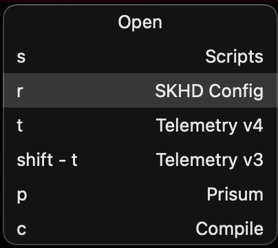

# Gui for SKHD

 

This is a helper GUI for SKHD ([https://github.com/koekeishiya/skhd](https://github.com/koekeishiya/skhd)) to display the current mode and all mode-specific shortcuts for the next keypress. Also supports mouse navigation of the list.

### Usage
Run `skhdgui -d` in the background. This process will control the window and optional status bar item.

```
USAGE: skhdgui [--status <status>] [--color <color>] [--window <window>] [--next] [--previous] [--click] [--hide-window] [--hide-status] [--daemon]

OPTIONS:
  -s, --status <status>   Show the status bar with label
  -c, --color <color>     Color for the status item (#817A2B)
  -w, --window <window>   Show the window for mode
  -n, --next              Select the next item
  -p, --previous          Select the previous item
  -C, --click             Click the selected item
  -W, --hide-window       Hide the window if visible
  -S, --hide-status       Hide the status item if visible
  -d, --daemon            Run as gui daemon
  -h, --help              Show help information.
```

In your skhdrc:
```
::default : skhdgui -W
::Open : skhdgui -w Open
::Web : skhdgui -w Web

# Mode select
Open, Web < escape ; default
Open, Web < up : skhdgui -p
Open, Web < down : skhdgui -n
Open, Web < return : skhdgui -C

### Web Mode
rctrl - w ; Web

# Canvas
Web < c : skhd -k escape; open https://github.com


### Open Mode
rctrl - space ; Open

# Scripts
Open < s : skhd -k escape; mate ~/.config/scripts
```

The name will be pulled from the comment above the shortcut configuration in skhd, and the full shortcut section will be displayed. See the regex in `ConfigParser.swift` for details.

### Building

To build, you will need a recent version of XCode. Clone the repository, open `skhdgui.xcodeproj` in XCode, and it should build successfully (we hope, please feel free to submit an issue if you find significant issues building using XCode). 

### Current limitations
 - Only shortcuts which refer to the exact mode "Open", not "Open, Web" will be recognized.
 - `.load` ignored
 - Config is re-parsed on every `skhdgui -w <mode>` command
